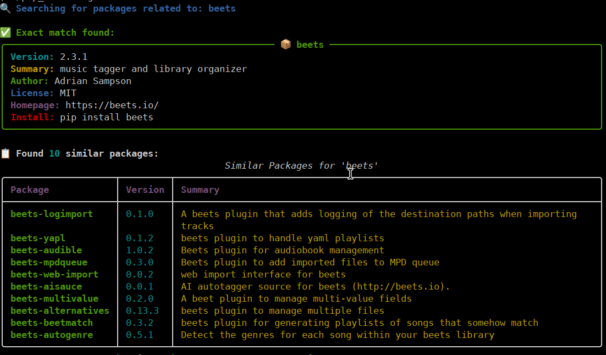

# PyPI Search Tools 📦

Two variants of pip (Pypy) search tools. Both variants where developed with help
of AI tools (Claude and Gemini). I started with Claude which produced a nice and
reliable solution after a few steps. I switched to Gemini to produce a solution
similar to the original `pip_search` with table output. This was a little hairy
but the final code was also reliable. The Gemini code is based on the Claude
generated code.

## Example for pypy_search
~~~
$ pypi_search beets -l 5
~~~

~~~
🔍 Searching for packages related to: beets

✅ Exact match found:

📦 beets
   Version: 2.3.1
   Summary: music tagger and library organizer
   Author: Adrian Sampson
   License: MIT
   Homepage: https://beets.io/
   Repository: https://github.com/beetbox/beets
   Install: pip install beets
------------------------------------------------------------

📋 Showing 5 of 62 packages containing 'beets' (use -l 0 for all results):

1. beets-alternatives
   Summary: beets plugin to manage multiple files
   Version: 0.13.3
   Install: pip install beets-alternatives

2. beets-bbq
   Summary: blackbird style search query plugin for beets
   Version: 0.0.1
   Install: pip install beets-bbq

3. beets-alias
   Summary: Alias Plugin for Beets
   Version: 1.0.1
   Install: pip install beets-alias

4. beets-ydl
   Summary: Download audio from youtube-dl soures and import into beets
   Version: 0.0.4
   Install: pip install beets-ydl

5. beets-beatport4
   Summary: Plugin for beets (http://beets.io) to replace stock beatport plugin which is not yet compatible with Beatport API v4.
   Version: 0.3.4
   Install: pip install beets-beatport4
~~~

## Example for pip_search-ng

